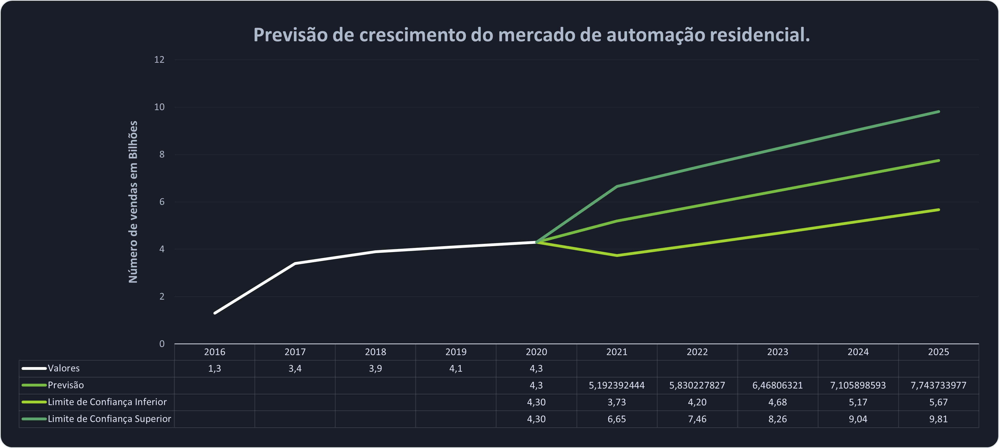
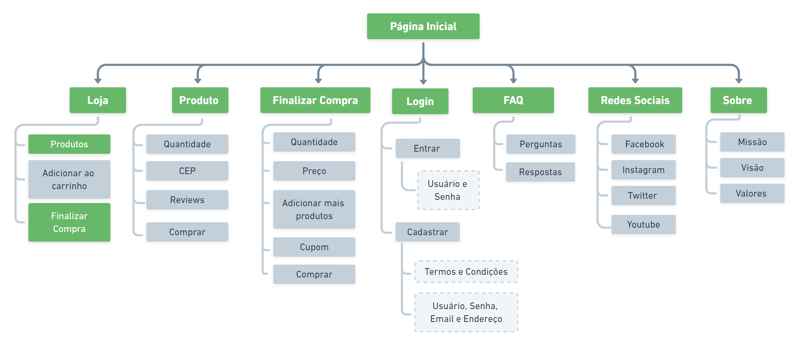
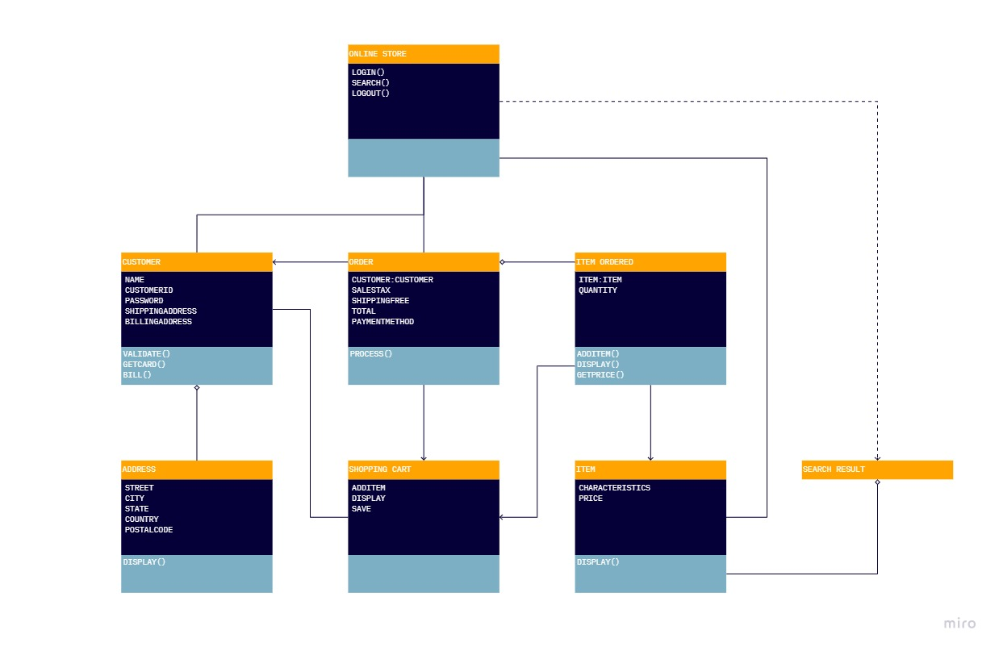

 
 

  

  

    <strong>Quem</strong>
    Somos?
  

  

    SmartHome é uma loja que com apenas um toque, te permite automatizar totalmente a sua casa,  
    trazendo mais conforto, entretenimento e segurança aos seus familiares.  
    <a href="#sumario">
      <strong>Documentação »</strong>
    </a>
     
     
    <a href="https://github.com/lsaque/smarthome">Visualizar Demonstração</a> |
    <a href="https://github.com/lsaque/smarthome/issues">Reportar Bug</a> | 
    <a href="https://github.com/lsaque/smarthome/pulls">Solicitar Contribuição</a>
     
    Construído com 💚 por
      <a href="https://github.com/lsaque">
        Isaque
      </a> e 
      <a href="https://github.com/brunamazzaron">
        Bruna
      </a>
    
      
  

 

## SUMÁRIO
<ol>
  <li><a href="#1-resumo">RESUMO</a></li>
  <li>
    <a href="#2-introdução">INTRODUÇÃO</a>
    <ul>
      <li><a href="#21-análise-de-mercado">Análise de Mercado</a></li>
      <li><a href="#22-ciclo-de-vida-do-setor">Ciclo de vida do Setor</a></li>
      <li><a href="#23-problema">Problema</a></li>
      <li><a href="#24-objetivo-geral">Objetivo Geral</a></li>
    </ul>
  </li>
  <li>
    <a href="#3-empresa">EMPRESA</a>
    <ul>
      <li><a href="#31-princípios">Princípios</a></li>
      <li><a href="#32-público-alvo">Público Alvo</a></li>
      <li><a href="#33-dor">Dor</a></li>
      <li><a href="#34-persona">Persona</a></li>
      <li><a href="#35-proposta-de-valor">Proposta de Valor</a></li>
    </ul>
  </li>
  <li><a href="#4-metodologia-de-desenvolvimento">METODOLOGIA DE DESENVOLVIMENTO</a></li>
  <ul>
    <li><a href="#41-análise-de-requisitos">Análise de Requisitos</a></li>
    <li><a href="#42-técnicas-utilizadas">Técnicas Utilizadas</a></li>
    <li><a href="#43-modelo-de-desenvolvimento-de-software">Modelo de desenvolvimento de software</a></li>
  </ul>
  <li><a href="#5-ferramentas-de-desenvolvimento">FERRAMENTAS DE DESENVOLVIMENTO</a></li>
    <ul>
      <li><a href="#51-linguagens-utilizadas">Linguagens Utilizadas</a></li>
      <li><a href="#52-bibliotecas-importadas">Bibliotecas Importadas</a></li>
      <li><a href="#54-ferramentas-gráficas">Ferramentas Gráficas</a></li>
      <li><a href="#55-ferramentas-de-apoio">Ferramentas de Apoio</a></li>
    </ul>
  <li><a href="#6-análise-de-sistemas">ANÁLISE DE SISTEMAS</a></li>
  <ul>
    <li><a href="#61-mapa-do-site">Mapa do Site</a></li>
    <li><a href="#62-funcionalidades">Funcionalidades</a></li>
  </ul>
  <li><a href="#7-considerações-finais">CONSIDERAÇÕES FINAIS</a></li>
</ol>

 

## 1. RESUMO

Automação residencial é fazer com que todos os sistemas eletrônicos funcionem como um sistema único, dispositivos com assistentes pessoais que funcionam por comando de voz, sob o nosso total controle e de acordo com nossos hábitos, necessidades e gostos, e se aplica a todas as tecnologias existentes dentro de casa para facilitar tarefas que antes dependiam somente do morador e proporcionando mais praticidade, adaptalidade, conforto e segurança. Sensores de fumaça, fechaduras eletroeletrônicas capazes de identificar se está ocorrendo alguma tentativa de violação da propriedade, torneiras que medem a quantidade de água usada e temporizadores são apenas alguns dos exemplos. 

Se hoje a automação residencial, predial e corporativa parece uma inovação tecnológica longínqua e futurista para você, as tendências do mercado de automação no Brasil para 2025 mostrarão o contrário.

Os brasileiros vêm, ao longo dos anos, demonstrando cada vez mais interesse em tornar suas casas inteligentes e conectadas. Existem prospecções que vislumbram a possibilidade da automação já ter começado a se estabelecer no mercado nacional, valorizando os imóveis e tornando a experiência de morar em uma residência automatizada cada vez mais imersiva e personalizada.

 

## 2. INTRODUÇÃO
A automação residencial é um dos seguimentos da área da automação que consiste em ações para transformar o visual, a maneira em que a pessoa vive e interage com a sua casa, com o propósito de ganhar tempo e eficiência nas tarefas domésticas. Os números dessa indústria de automação residencial vêm crescendo fortemente nos últimos anos, e tende a crescer ainda mais para os próximos, de acordo com a seguinte análise de previsão e viabilidade:

  
  
    <i>Previsão de mercado criado com 
      <a href="https://www.microsoft.com/en-us/microsoft-365/excel" title="Excel is a spreadsheet editor produced by Microsoft for computers.">
        @Excel
      </a>
    </i>
  

 O projeto propõe o desenvolvimento de um ecommerce com a integração de um exclusivo sistema de plano de assinatura, o qual servirá para clientes que gostariam de ter todo um suporte, customização, instalação e acompanhamento em tempo real de seus dispositivos e gastos.

### 2.1 Análise de Mercado
O projeto tem como principal foco o setor de automação residencial, buscando assim trazer para o mercado nacional o setor de casas inteligentes.
De acordo com a análise de mercado, foi concluído que o potencial público alvo para a implementação de automação residencial em sua grande maioria, encontra-se com a idade de [18-34 anos](https://connectamericas.com/content/who%E2%80%99s-buying-home-automation-devices).

Em meio a diversas pesquisas, foi possível concluir que são poucas as lojas virtuais que tentam entregar a "ideia" de comercializar de maneira completa o kit de automação residencial, sendo preferível por elas mesmas, venderam unidades que não se comunicam entre si, abrindo assim uma enorme chance de sucesso e inclusão por nossa parte no mercado nacional.

Embora o Brasil não tenha ainda muitas residências com projetos de automação, o interesse por eles é grande, de acordo com a pesquisa fornecida pelo Sebrae Inteligência Setorial, [78%](https://www.institutodaconstrucao.com.br/blog/oportunidade-automacao-residencial-brasil/) das residencias particulares tem interesse em receber e/ou implementar a automação em suas casas.

#### 2.1.1 Macrorregião
Com base em pesquisas realizadas, atualmente temos um número de aproximadamente [72 milhões](https://educa.ibge.gov.br/jovens/conheca-o-brasil/populacao/21130-domicilios-brasileiros.html) de residências em território nacional, cuja atutomação só está presente em [0,5%](https://www.institutodaconstrucao.com.br/blog/oportunidade-automacao-residencial-brasil/) delas. O mercado de automação residencial se mantem super aquecido e tem como previsão atingir [U$3,1 bilhões](https://quatriautomacao.com.br/blog/setor-de-automacao-residencial-espera-alcancar-marca-de-11-bi-em-2020/) em 2025, ou seja, é um setor que cresce cada vez mais e está em constante avanço.

Em relação a atividade de automação residencial, a macrorregião de mercado está se tornando cada vez mais favorável em relação a sua produção e desenvolvimento, tornando o projeto altamente viável para ser executado.

#### 2.1.2 Microrregião
Atualmente são poucas as casas que recebem algum tipo de automação em território nacional, no entanto, devido a alta taxa de interesse, é possível destacar que há uma grande demanda por parte do mercado, fortacelendo assim a idéia de que as pessoas andam se importando em oferecer um conforto e infraestrutura a mais em seus lares.

Conforme os estudos realizados pela IDC, international Data Corporation Brasil, o consumo de dispostivos automativos para residencias teve um crescimento de [21%](https://newvoice.ai/2021/02/05/idc-projeta-alta-de-21-para-mercado-de-casa-inteligente/) no Brasil, este fator demonstra que o mercado de automação residencial está em constante crescimento e aprimoramento.

### 2.2 Ciclo de vida do setor
O conceito de automação surgiu na década de 1970, nos Estados Unidos, quando os primeiros sistemas automatizados de controle foram criados para aplicações industriais.

Atualmente estamos em fase de crescimento. Em 2020 a automação residencial proporcionou um mercado Brasileiro de `R$1,1 bilhões`, e conta com uma previsão de `R$3,1 bilhões` em 2025. (Fonte: O Estado de SP. Jan, 2021)

#### 2.2.1 Identificação de lacunas
Em geral pouco dos concorrentes tem destaque no mercado e/ou apresentam um grande diferencial. Na maioria das vezes os produtos são importados e muito caros, não permitem uma conectividade ampla com demais dispositivos, não possuem planos de assinatura com kit completo de automação, as interfaces não são tão bem planejadas, e não cobrem a assistência e instalação desses dispositivos.

### 2.3 Problema
Como aperfeiçoar e facilitar o acesso de pessoas a terem suas casas automatizadas, com uma melhor gestão de tempo e gastos.

#### 2.3.1 Justificativa
Através de inúmeras pesquisas e tendo em vista o atual mercado de automação residencial, é possível concluir que o mesmo não se encontra tão abrangente no quesito custo-beneficio. No entanto, o desenvolvimento deste projeto traz consigo uma solução justa para este problema

Isso é factível através do plano por assinatura, que com um baixo custo, torna possível usufruir de uma casa inteligente com: conforto, segurança, automação de atividades domésticas, gerenciamento de energia, mobilidade interna, cuidados com saúde, entretenimento e sustentabilidade ambiental.

### 2.4 Objetivo Geral
Tornar acessível a automação residencial, com o objetivo de facilitar e promover a gestão de energia, gastos e economia de tempo por parte das atividades domésticas.

 

## 3. EMPRESA
SmartHome é uma empresa de Automação Residencial. Desenvolvemos projetos de acordo com a necessidade de cada cliente, executando com competência, cumprindo prazos e superando expectativas.

Nossa prioridade é qualidade de atendimento para atender todas as expectativas de nossos clientes. Por isso desenvolvemos projetos completos trazendo o melhor em tecnologia para sua casa e empresa.

### 3.1 Princípios
- **Visão:** Ser uma das primeiras empresas do ramo de Automação Residencial a prestar atendimento 100% remoto e com atendimento presencial para a instalação e manutenção de todos os equipamentos.
- **Missão:** Atender o publico de forma diferenciada, sem que o cliente tenha que sair de sua casa ou local de trabalho, otimizando seu tempo e sem se preocupar em procurar um profissional especializado, que atenda as suas necessidades. Oferecer planos de assinatura e atendimento 24 horas.
- **Valores:** 
  - Proximidade e satisfação ao cliente;
  - Alta performance;
  - Adicionar valor;
  - Renovação;
  - Respeito;
  - Responsabilidade;
  - Sustentabilidade.
- **Propósito:** Criar um mundo onde o conforto, praticidade e a mobilidade seja de uma fonte de segurança e acessível.  

### 3.2 Público-alvo
Homens, entre 18 e 34 anos, residentes na região Sudeste do país, com formação superior, classe C, renda entre `R$1.500,00` e `R$2.200,00`, apaixonados por automação e tecnologia.

### 3.3 Dor
Empresas que não estão focadas em tornar os seus produtos de automatização residencial acessíveis, que não oferecem suporte pós venda e muito menos um plano de assinatura custo-beneficio aos seus clientes.

### 3.4 Persona
João, 24 anos, mora sozinho e é estudante de Análise e Desenvolvimento de Sistemas. Tem uma enorme paixão por dispositivos tecnológicos e Internet das Coisas. Acorda cedo, trabalha como CLT e estuda o último ano da faculdade. João, por estar numa rotina super corrida, acaba nem sempre lembrando de apagar as luzes e trancar a porta quando sai de casa.

### 3.5 Proposta de Valor
SmartHome permite que com um toque, você possa automatizar totalmente a sua casa, trazendo mais conforto, entretenimento e segurança aos seus familiares.

 

## 4. METODOLOGIA DE DESENVOLVIMENTO
No projeto ficou decidido o uso da metodologia ágil, o Scrum, por ser de fácil gestão de etapas e ter foco em entrega de valor.

### 4.1 Análise de requisitos
`(Ainda precisamos pensar a respeito)`

### 4.2 Técnicas utilizadas
**Brainstorming:** Primeira técnica aplicada e que tem papel fundamental para um simples esboço da ideia central. O brainstorming é feito em forma de reuniões onde são compartilhadas todas as ideais e as mesmas são mescladas para gerar algo definitivo e/ou aprimorar a ideia anterior.

**Análise de Mercado:** Segunda técnica utilizada com a finalidade de descobrir o campo de alcance do projeto para que sejam definidos os próximos passos que o grupo deverá tomar, também é necessário o conhecimento do setor que a plataforma será inserida. Análise de Mercado é realizada por meio de pesquisas e coletas de dados em sites, artigos, e estatísticas com relação ao mercado.

**Pesquisas:** Terceira técnica aplicada com o objetivo de levantar dados e discutir se o projeto é realmente válido, e se tem demanda no mercado.

**Oberservação Direta:** Quarta e última técnica utilizada com o intuito de avaliar o próprio grupo e o projeto identificando problemas, soluções e o mais importante, definir o objetivo geral.

### 4.3 Modelo de desenvolvimento de software
O **Scrum** foi impletado como a metodologia de desenvolvimento do ecommerce por se tratar da metodologia ágil com a melhor forma de gerenciar etapas de desenvolvimento, além de ter o foco principal em entrega de valor. Nela é possível analisar três importantes aspectos: transparência, inspeção e adaptação.

- **Transparência:** todos os processos devem estar sempre visíveis aos responsáveis do projeto;
- **Inspeção:** os contribuintes devem estar periodicamente verificando a progressão das atividades;
- **Adaptação:** qualquer mudança ordenada pelos gestores de planejamento deverá ser implantada ou adaptada o quanto antes. 

Com a implementação do Scrum, será possível trabalhar com pequenas equipes de pessoas altamente flexíveis e adaptativas, tendo como sua composição três grandes papéis: `Scrum Master`, `Product Owner` e `Time`.

 

## 5. FERRAMENTAS DE DESENVOLVIMENTO 

Para o desenvolvimento do projeto, foram necessários alguns recursos, segue abaixo os recursos utilizados.

### 5.1 Linguagens utilizadas

- [HTML5](https://pt.wikipedia.org/wiki/HTML5)
- [CSS3](https://pt.wikipedia.org/wiki/CSS3)
- [JavaScript](https://pt.wikipedia.org/wiki/JavaScript)

### 5.2 Bibliotecas importadas

- [React](https://reactjs.org/)
- [Styled Components](https://styled-components.com/)
- [TypeScript](https://www.typescriptlang.org/)

<!-- ### 5.3 Ferramentas de banco de dados
v
`Nenhum até o presente momento` -->

### 5.3 Ferramentas gráficas

- [Affinity Designer](https://affinity.serif.com/pt-br/designer/)
- [Adobe Photoshop](https://www.adobe.com/br/products/photoshop.html)
- [Adobe XD](https://www.adobe.com/br/products/xd.html)

### 5.4 Ferramentas de apoio

- [Visual Studio Code](https://code.visualstudio.com/)
- [Google Chrome](https://www.google.com/intl/pt-BR/chrome/)
  - [Trello](https://trello.com/)
  - [Whimsical](https://whimsical.com/)
  - [Miro](https://miro.com/app/)
- [Microsoft Word](https://www.microsoft.com/en-us/microsoft-365/word)
- [Microsoft Excel](https://www.microsoft.com/en-us/microsoft-365/excel)

 

## 6. ANÁLISE DE SISTEMAS
A análise de sistemas tem como objetivo mostrar de maneira prática e objetiva as etapas que estão no sistema e cada função, para assim mostrar e explicar os processos utilizadaos até chegar ao usuário final.

### 6.1 Mapa do site

  
  
    <i>Mapa do site criado com
      <a href="https://whimsical.com/" title="Whinsical is the visual workspace for thinking and collaboration.">
        @Whimsical
      </a>
    </i>
  

### 6.2 Funcionalidades

  
  
    <i>Guia de funcionalidades criado com
      <a href="https://miro.com/app/" title="Miro is the online collaborative whiteboard platform to bring teams together, anytime, anywhere.">
        @Miro
      </a>
    </i>
  

 

## 7. CONSIDERAÇÕES FINAIS

A casa inteligente já existe e está presente em nossas vidas através da
automação residencial aliada a internet das coisas. Com essa nova tendência
relacionada ao mercado da construção civil, surgirão novidades atrás de novidades a uma velocidade semelhante à das comunicações e quando percebermos já estaremos integrados a elas.

Se tornará comum optarmos por um imóvel novo com cada vez mais auxílio da tecnologia, dessa forma o mercado precisará se adaptar para as novas
necessidades dos compradores. O construtor e o engenheiro civil precisam se
preparar para isso, da mesma forma que um mundo mais sustentável já vem os cobrando. As necessidades do consumidor moderno irão exigir uma constante atualização das empresas e dos profissionais.

Com isso é possível reparar que o mercado da construção civil e automação estão sempre preparados para novidades, sejam elas de projeto, de infraestrutura, de gerência ou de novas tecnologias, como apresentado neste projeto. 

 
